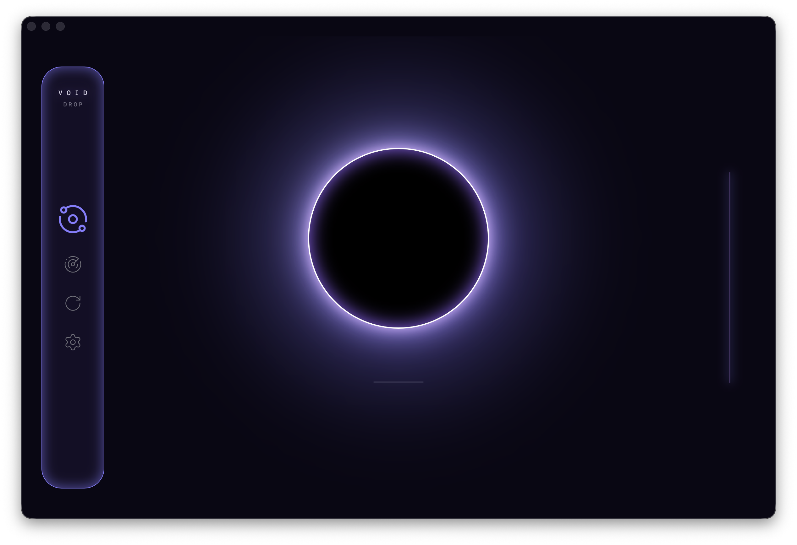
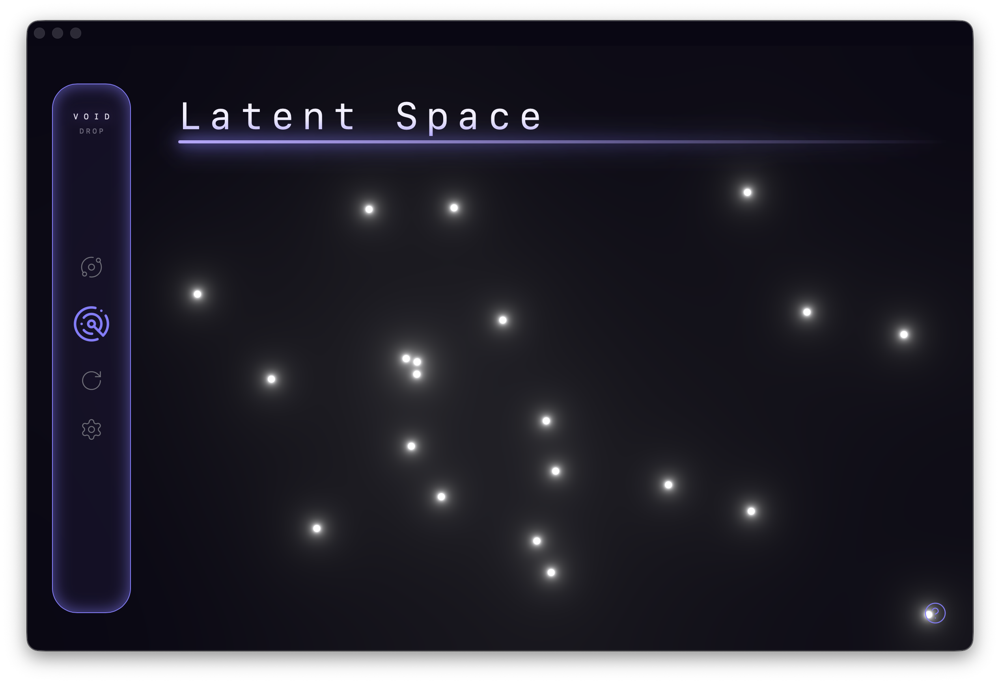

# VoidDrop

A local-first AI notes app where thoughts, files, images, and code collapse into a searchable semantic galaxy.

No folders. No tagging. Just search by vibes.

https://github.com/user-attachments/assets/a7b04cb6-fcb3-424f-be4c-472b33a80b33

## Overview

VoidDrop is a desktop application built with Rust, Tauri, and React.
At its core is a **Black Hole** — a drop zone where you feed it anything: a fleeting thought, a PDF, an image, a link, a code snippet.
VoidDrop converts everything into AI embeddings and stores them locally, letting you retrieve information by *meaning* rather than exact keywords or folder structure.

You don't organise. You don't tag. You just search by **vibes**.

---

## Stack
- **Backend**: Rust + Tauri
- **Frontend**: React + TypeScript + TailwindCSS + Framer Motion + Three.js
- **Storage**: SQLite with `sqlite-vec` for vector storage and cosine similarity queries
- **Models**: Local sentence embedding model (384d) + CLIP (512d) for images

## Rendering
The Latent Space and fragment list use performance-conscious rendering:
- **Three.js + HTML5 Canvas** for the galaxy (avoiding hundreds of DOM nodes)
- **Virtualised lists** so only visible cards are in the DOM
- **Lazy loading** for file and image previews — content renders only when a card is expanded

---

## Features

### The Black Hole
Drop anything into the void:
- **Text Notes:** Typed directly
- **Documents:** PDF, DOCX, PPTX, and more
- **Images** including HEIC, with automatic conversion
- **Code:** File type and language are detected and passed to the model for better context

### Semantic "Vibes" Search
Search by meaning, not keywords. Powered by local embedding models, results are ranked by cosine similarity.
- **Text** use a 384 dimensional sentence embedding model
- **Documents** use the same model as for thoughts, and are chunked automatically to find the average meaning
- **Images** use CLIP, which shares an embedding space with text — enabling cross-modal search. Raw CLIP scores are calibrated so images rank accurately alongside text results

### Latent Space Visualiser
Every fragment the user has ever saved is plotted as a **star** in a **galaxy** using Orthogonal Projection.

Two perpendicular vectors define a 2D plane in the 512 dimensional embedding space. Each fragment's position is computed by projecting its embedding onto these axes using dot products.
- **Cheap:** Only requires dot products, no iterative fitting
- **Absolute:** Independent of the data; pure linear algebra
- **Consistent:** The projection vectors are generated once and never change, so points don't shift between sessions.

The result is a unique, personal galaxy whose shape is determined entirely by the *semantic structure* of your own data.

## License

This project is licensed under the MIT License
